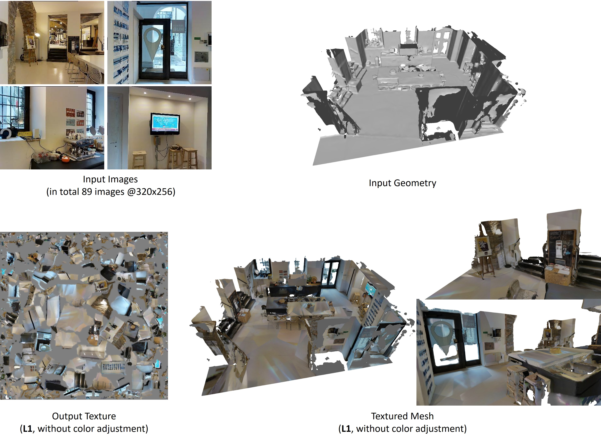

# NeuralTexGen

This code is meant for simple image-space texture optimization.
As input you have to provide uv-renderings of the target scene along with the color observations.
Based on these 'UV-maps' and the color images one can use PyTorch with the differentiable bilinear sampling to 'train' a color texture under a specific error metric.
You can have arbitrary image losses like L1, L2 or style losses (like VGG content & style loss).

## Training Data

### 3D Reconstruction
You need to have a reconstructed mesh of the target object/scene along with the camera parameters for each image.
Some approaches that I used in the past:
- KinectFusion with MarchingCubes
- VoxelHashing [(Github repo)](https://github.com/niessner/VoxelHashing)
- BundleFusion [(Github repo)](https://github.com/niessner/BundleFusion)
- Colmap [(Project Page)](https://colmap.github.io/)

### Parametrization
As we want to optimize for a texture, we have to define a texture space including the mapping from the vertices of the mesh to the texture space (Parametrization).
To this end you can use trivial per triangle parametrization (not recommended) or some more advanced techniques to compute the parametrization.
You can use MeshLab for trivial parametrizations, Blender or the UV parametrization tool from Microsoft [(Github repo)](https://github.com/microsoft/UVAtlas).

Tip: If you have a highly tesselated mesh you might want to reduce it (e.g. using the edge collapse filter of MeshLab), otherwise tools like the Microsoft UV Atlas generator will take forever.

### Rendering of the UV maps
Use a renderer of your choice to render the per frame uvs using the mesh and the camera parameters.
For example, you can use an headless 'EGL-based' OpenGL renderer on your server (see 'preprocessing' folder).
Caution: do not render with anti-aliasing this will lead to wrong uvs! Also never upsample uv renderings!
It is recommended to render the uv maps at a higher resolution than the color images to circumvent sampling issues (undersampling of the texture).
Have a look at the 'prepare_data.sh' script that calls an OpenGL renderer.
If you have set the input accordingly you can call:

```bash prepare_data.sh```

You might need to make the uv renderer executable: ```chmod +x preprocessing/uv_renderer```.

### Summary
In the end you should have training pairs consisting of a uv map and a original color image which serves as target image.

## Optimization

### Define a loss function / loss weights
First of all, you have to choose the loss weights.
See 'texture_optimization.sh' and 'options/base_options.py'.
Feel free to add new loss functions (see 'models/RGBTextures_model.py').

### Optimize aka 'Train'
Start a visdom server that visualizes the training curve.

```visdom```

Start optimization over the entire training data corpus using:

```bash texture_optimization.sh```


### Example

Below you see an example using an L1 loss. It is applied to a Matterport scene with 89 images with a resolution of 320x256 each (which is quite low).
Nevertheless, we can reconstruct a reasonable texture. Note that in this example, we did not apply any correction for whitebalancing / color normalization.



## Misc

You can use image enhancing techniques or image super-resolution methods to improve the input images.
An easy to use implementation has been published by Idealo [(Github repo)](https://github.com/idealo/image-super-resolution).
See 'misc/super_res.py' for preprocessing your training data (note that the dataloader resizes the color images to match the uv images, thus, make sure you render the uvs with a higher resolution too).

The 'tmux_smpl.sh' script has nothing to do with the texture optimization but simplifies the tmux session handling ;)

## Notes

Note that this type of image-space texture optimization can have sampling issues when the texture that we optimize for is undersampled.
We, therefore, have a regularizer of the texture based on a Laplacian pyramid (i.e., regularizing neighboring texture values to be similar).
You can also cicumvent the potential sampling issues by rendering the UV-maps at higher resolutions (kind of multi-sampling).

Note that you typically operate in texture space to make sure that you optimize for all texels in the texture.
You would project the surface point corresponding to a texel to the input images to read out the target colors which you can accumulate (you can apply averaging, or some more advanced 'fusion' step).
In this project, you go from image-space to texels, optimizing the texel colors that are sampled by a forward renderer (-> UV maps) such that it matches the color from the image.
It is trivial to implement and to extend (e.g. you can easily add different image-space losses).

## TODOs

If you have a nice uv parametrization you can also think of adding mip-mapping to the framework, thus, you would provide uv and the mip-level as input.
Given the mip-level you can filter the texture on the fly or you precompute the mip levels. This can also be done differentiable and solves the potential sampling issues.

## Ackowledgements
This code is based on the Pix2Pix/CycleGAN framework [(Github repo)](https://github.com/junyanz/pytorch-CycleGAN-and-pix2pix).